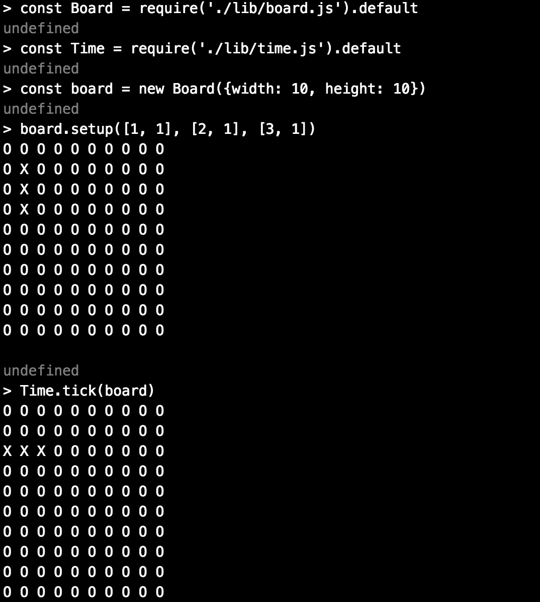

# The Game of Life

## Description

* A tech test for week 10 of Makers Academy, written in Javascript (ES6) and test-driven with Jest.
* The user can create a grid of cells, and setup some cells as alive.
* After each 'tick', the cells in the grid evolve according to the following rules:
  * Any live cell with 2 or 3 live neighbours survives until next tick.
  * Any live cell with less than 2 live neighbours dies (underpopulation).
  * Any live cell with more than 3 live neighbours dies (overpopulation).
  * Any dead cell with exactly 3 neighbours becomes a live cell (reproduction).

## How to Use

* Clone this repo.
* Install dependencies with `npm install`

### Testing
* Run `jest --coverage` to run tests and see coverage.

### Interacting with the program
* Run `npm run build` to build the project (this is needed to use ES6 modules in node)
* Open the `node` REPL in the console and type the following:

`> const Board = require('./lib/board.js').default`
`> const Time = require('./lib/time.js').default`

* To create a new 10x10 board:

`> const board = new Board({width: 10, height: 10})`

* To setup the board with some living cells:

`> board.setup([1, 1], [2, 1], [3, 1])`

* To progress time by one tick:

`> Time.tick(board)`

## My Approach

* I have aimed for a separation of concerns in my classes, keeping each to a single responsibility. Cells control their current and next state (alive or dead), and know about their neighbours. The Board holds a grid of cells, which can be setup with different patterns of living and dead cells. The BoardView renders a view of the current board to the console. Time decides and enacts the fates of cells upon each tick, because time is cruel.
* I test-drove the implementation of each feature in Jest.
